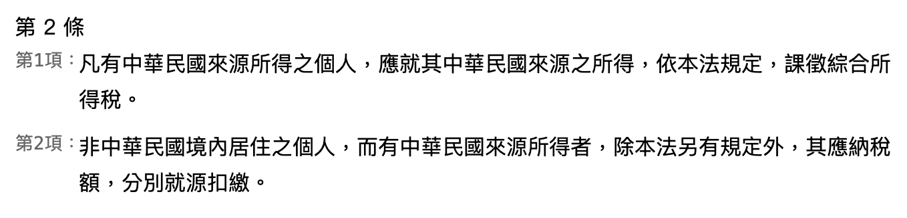

# 法規條文項次顯示器（v1.8）

## 簡介

本使用者腳本專為 [全國法規資料庫](https://law.moj.gov.tw/) 設計，能自動為條文中的每一項插入「第 X 項」標示。

不同於原網站以 CSS `::before` 虛擬元素顯示項次，本腳本使用實體 `span` 元素動態插入，不僅可直接複製、格式穩定，亦不破壞原始排版或對齊。

## 功能特色

- 自動插入「第 X 項」標示
- 不影響條文原始排版與對齊
- 自動隱藏原本的 ::before 數字
- 內建右上角切換按鈕（顯示／隱藏 項次）
- 採用 monospace 字體（Consolas），強化可讀性
- 架構模組化，便於維護與擴充

## 適用網站

- https://law.moj.gov.tw/LawClass/LawAll.aspx*
- https://law.moj.gov.tw/LawClass/LawSingle.aspx*

## 安裝方式

1. 安裝 [Tampermonkey](https://www.tampermonkey.net/)（建議使用）
2. 點擊下方連結安裝腳本：

   [安裝腳本](./dist/law-item-label.user.js)

## 預覽畫面

圖片可見 `preview/` 資料夾：

## 使用授權

本腳本以 MIT License 授權。詳見 [`LICENSE`](./LICENSE)。

---

作者：mt019（由 ChatGPT 協助模組化與重構）  
版本：v1.8