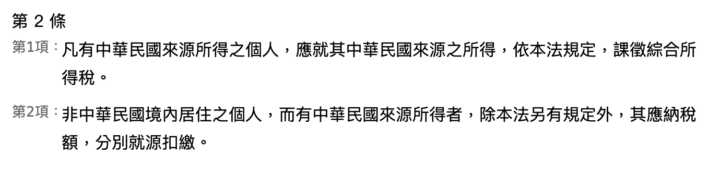

# 法規條文項次顯示器

*Law Item Labeler — a userscript for Taiwan's Laws & Regulations Database (全國法規資料庫). The site paints each paragraph number with a CSS `::before`, so selecting a provision copies the text without its numbering. This inserts real text elements instead, leaving the original layout alone. Install from <https://phenomcanvas.com/scripts/law-item-labeler.user.js>; the rest of this page is in Chinese.*

## 簡介

本使用者腳本專為 [全國法規資料庫](https://law.moj.gov.tw/) 設計，能自動為條文中的每一項插入「第 X 項」標示。

不同於原網站以 CSS `::before` 虛擬元素顯示項次，本腳本使用實體 `span` 元素動態插入，不僅可直接複製、格式穩定，亦不破壞原始排版或對齊。

## 功能特色

- 自動插入「第 X 項」標示
- 不影響條文原始排版與對齊
- 自動隱藏原本的 `::before` 號碼
- 內建右上角切換按鈕（顯示／隱藏 項次）
- 採用 monospace 字體（Consolas），強化可讀性
- 架構模組化，便於維護與擴充

## 適用網站

- `https://law.moj.gov.tw/LawClass/LawAll.aspx*`
- `https://law.moj.gov.tw/LawClass/LawSingle.aspx*`

## 🚀 安裝方式

1. 安裝 [Tampermonkey 擴充套件](https://www.tampermonkey.net/)（建議使用）
2. 點擊下方連結安裝腳本：

   👉 [點我安裝](https://phenomcanvas.com/scripts/law-item-labeler.user.js)

> 本腳本將自動在全國法規資料庫頁面中標示每一項，方便閱讀與複製。

那個網址同時是腳本的 `@updateURL`，裝好的副本從此固定查它，不管當初是從哪裡裝的。1.9.2 以前是從 GitHub Pages 的 `law-item-label.user.js` 裝的，那個檔名仍然照樣產出、內容與正式檔相同，會在下一次更新檢查把舊副本交給上面那個網址。

落地頁：<https://phenomcanvas.com/userscripts/law-item-labeler>。

## 預覽畫面

圖片可見 `preview/` 資料夾：

## 另外兩支

- [fjud-userscript](https://github.com/mt019/fjud-userscript)——在任何頁面選中文字，按快捷鍵直接開司法院裁判書系統並送出查詢。
- [social-auto-expand-userscript](https://github.com/mt019/social-auto-expand-userscript)——LinkedIn 與 Facebook 動態的「查看更多」自動展開。

三支都列在 <https://phenomcanvas.com/userscripts>。

## 使用授權

本腳本以 MIT License 授權。詳見 [`LICENSE`](./LICENSE)。

---

作者：mt019（由 ChatGPT 協助模組化與重構）  
版本：v1.9